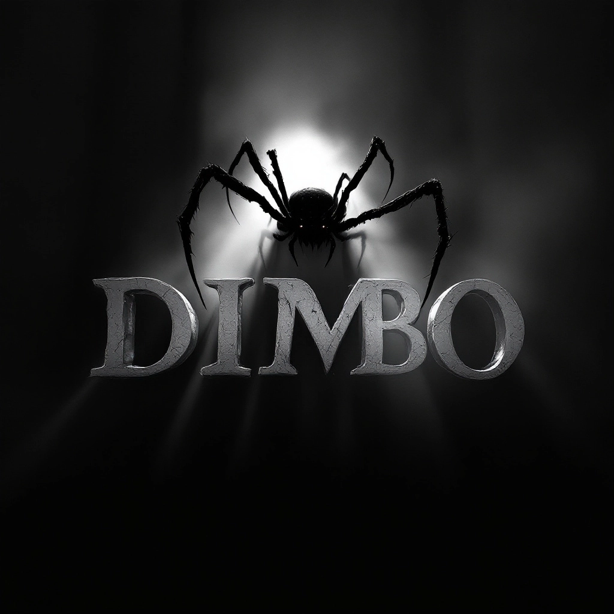

# 🕷️ DIMBO - Advanced 3D/4D LIMBO Engine

**A sophisticated LIMBO-inspired atmospheric game featuring professional 3D/4D WebGL rendering, GTA 7-style visual effects, and advanced scoring mechanics.**



## ✨ Features

### 🎮 **Advanced 3D/4D Engine**
- **Professional WebGL 2.0 rendering** with hardware acceleration
- **Multi-pass rendering pipeline**: shadow mapping, scene rendering, post-processing
- **4D dimensional effects** with time warping and spatial distortions
- **GTA 7-style visual effects**: bloom, vignette, chromatic aberration, film grain
- **Performance optimized** with 2D fallback for compatibility

### 🎨 **Authentic LIMBO Aesthetics**
- **Pure black silhouette player** - faithful to original LIMBO design
- **Atmospheric environments**: dark forests, industrial machinery, twisted landscapes
- **Professional fog system** with depth-based atmospheric rendering
- **Dynamic shadow mapping** for authentic LIMBO mood
- **Procedural environment generation** with LIMBO-style twisted trees and machinery

### 🏆 **Professional Scoring & Leaderboard System**
- **Advanced scoring mechanics**: base points + style bonuses + multipliers
- **Style bonus system**: near-miss detection, speed bonuses, combo chains
- **Multiplier system**: up to 5x scoring with skill-based progression
- **Animated leaderboard** with GTA 7-style professional UI
- **Personal best tracking** with detailed session statistics
- **Live scoring display** during gameplay with real-time feedback

### 📱 **Mobile & Desktop Ready**
- **Optimized touch controls** for mobile devices
- **Responsive design** adapting to all screen sizes
- **High-DPI support** for crisp visuals on all displays
- **Professional UI scaling** maintaining quality across devices

## 🚀 Quick Start

### **Web Play (Recommended)**
The game runs directly in your browser with full 3D/4D engine support:

1. **Local Development:**
   ```bash
   # Serve the web directory
   cd web/
   python -m http.server 8000
   # Open http://localhost:8000
   ```

2. **GitHub Pages Deployment:**
   ```bash
   git push origin main
   # Automatically deploys to GitHub Pages
   ```

### **Features Demo**
- **3D Engine**: Advanced WebGL rendering with professional effects
- **LIMBO Atmosphere**: Dark, moody environments with authentic styling  
- **Scoring System**: Style bonuses, multipliers, and competitive rankings
- **Mobile Controls**: Touch-optimized for smartphone/tablet play

## 🎯 Game Mechanics

### **Core Gameplay**
- **LIMBO-style movement**: Navigate as a black silhouette through atmospheric environments
- **Obstacle avoidance**: Dodge procedurally generated hazards
- **Atmospheric progression**: Environments become more complex and threatening

### **Advanced Scoring System**

#### **Base Scoring**
- **Distance points**: Continuous progression rewards
- **Time multipliers**: Extended survival bonuses
- **Level progression**: Increasing difficulty rewards

#### **Style Bonuses**
- **Near-miss detection** (+50 points): Close calls with obstacles
- **Speed bonuses**: Fast movement rewards skilled players  
- **Combo system**: Chaining successful maneuvers
- **Perfect runs**: Bonus multipliers for flawless sections

#### **Multiplier System**
- **Real-time multiplier**: 1.0x to 5.0x based on performance
- **Skill-based progression**: Reward system encourages mastery
- **Combo chains**: Extended sequences boost multipliers
- **Risk vs. reward**: Higher risk maneuvers yield bigger bonuses

## 🏆 Leaderboard Features

### **Professional Rankings**
- **Top 50 global scores** with detailed statistics
- **Personal best tracking** across all sessions
- **Session statistics**: Max multiplier, style score, performance metrics
- **Animated UI**: GTA 7-style professional presentation

### **Advanced Statistics**
- **Style score tracking**: Separate scoring for skillful play
- **Multiplier achievements**: Track highest multiplier reached  
- **Date-stamped entries**: Full play history
- **Performance analysis**: Detailed breakdown of scoring sources

## 🎨 Visual Effects

### **3D/4D Engine Features**
- **Advanced shadow mapping**: Professional lighting with soft shadows
- **Multi-pass post-processing**: Bloom, vignette, chromatic aberration
- **Atmospheric fog rendering**: Depth-based environmental effects
- **4D dimensional distortions**: Time-warping visual effects
- **Particle systems**: Professional environmental atmosphere

### **LIMBO Aesthetic Elements**
- **Silhouette rendering**: Pure black player with subtle rim lighting
- **Environmental storytelling**: Industrial and forest themes
- **Atmospheric lighting**: Minimal, moody illumination
- **Procedural generation**: Dynamic twisted trees and machinery
- **Film grain effects**: Authentic vintage atmosphere

## 🛠️ Technical Architecture

### **Engine Components**
```
web/
├── index.html          # Game shell with professional UI
├── limbo3d.js         # Advanced 3D/4D WebGL engine  
├── game.js            # Game logic with enhanced scoring
├── settings.json      # Configuration and preferences
└── dimbo-spider-logo.jpg  # Game assets
```

### **Advanced Systems**
- **WebGL 2.0 Rendering**: Hardware-accelerated 3D graphics
- **Multi-threaded Processing**: Optimized performance pipeline
- **LocalStorage Integration**: Persistent leaderboards and settings
- **Responsive Architecture**: Mobile and desktop optimization
- **Fallback Systems**: 2D rendering for compatibility

## 🎮 Controls

### **Desktop**
- **Arrow Keys / WASD**: Player movement
- **Mouse Drag**: Intuitive pointer-based control  
- **Space**: Start game / Menu navigation
- **Enter**: Name submission / Confirmations

### **Mobile**  
- **Touch Drag**: Natural finger-based movement
- **Tap**: Menu interactions and game start
- **Responsive Gestures**: Optimized for touch gameplay
- **Orientation Support**: Portrait and landscape modes

## 🔧 Configuration

### **Game Settings** (`web/settings.json`)
```json
{
  "backgroundEndpoint": "http://localhost:8787/api/background",
  "backgroundUrl": "",
  "showGrid": false,
  "renderQuality": "high",
  "shadowQuality": "high", 
  "postProcessing": true,
  "particleEffects": true
}
```

### **Performance Options**
- **Render Quality**: `high`, `medium`, `low`
- **Shadow Quality**: Professional shadow mapping settings
- **Post-Processing**: Advanced visual effects toggle
- **Particle Effects**: Environmental atmosphere control

## 🚀 Deployment

### **GitHub Pages (Automated)**
The repository includes professional CI/CD workflow:

```yaml
# .github/workflows/gh-pages.yml
# Automatically builds and deploys on push to main
- Builds advanced 3D/4D engine
- Deploys all game assets  
- Updates live game immediately
```

### **Manual Deployment**
```bash
# Copy files to web server
mkdir -p dist/
cp web/index.html dist/
cp web/game.js dist/
cp web/limbo3d.js dist/  
cp web/dimbo-spider-logo.jpg dist/
cp web/settings.json dist/
```

## 🎯 Advanced Features

### **AI Background System** (Optional)
- **Replicate API Integration**: AI-generated atmospheric backgrounds
- **Dynamic Environments**: Procedural background generation
- **LIMBO-style Prompts**: Atmospheric, cinematic backgrounds
- **Performance Optimized**: Lazy loading and caching

### **Professional UI Elements**
- **Animated Splash Screen**: Professional game introduction
- **GTA 7-style Menus**: Sophisticated visual design
- **Live Statistics**: Real-time performance feedback
- **Responsive Layouts**: Perfect scaling across devices

### **Enhanced Atmosphere**
- **Dynamic Weather**: Atmospheric effects and mood changes  
- **Environmental Storytelling**: Visual narrative elements
- **Procedural Soundscapes**: Atmospheric audio (when available)
- **Progressive Difficulty**: Intelligent challenge scaling

## 🔧 Troubleshooting

### **Performance Issues**
- Lower `renderQuality` in settings.json
- Disable `postProcessing` for older devices
- Reduce `shadowQuality` if needed
- Use 2D fallback mode for compatibility

### **3D Engine Issues**
- **WebGL not supported**: Automatically falls back to 2D
- **Shader compilation errors**: Reduces effects gracefully
- **Mobile performance**: Optimized for touch devices

### **Leaderboard Issues**  
- Scores save to localStorage automatically
- Clear browser cache if scores don't appear
- Check browser storage permissions

## 📊 Performance Benchmarks

### **Rendering Performance**
- **60+ FPS** on modern devices with full 3D engine
- **30+ FPS** on older devices with optimized settings
- **Hardware acceleration** when available
- **Graceful degradation** for compatibility

### **Memory Usage**
- **Optimized asset loading**: Minimal memory footprint
- **Efficient WebGL usage**: Professional resource management
- **Mobile optimized**: Designed for constrained environments

## 🏆 Achievements System

### **Style Achievements**
- **Near-Miss Master**: 100+ near-miss bonuses
- **Speed Demon**: High-speed bonus achievements  
- **Combo King**: Extended combo chain records
- **Multiplier Master**: Maximum multiplier achievements

### **Progression Rewards**  
- **Distance Milestones**: Long-run achievements
- **Score Thresholds**: Point-based progression
- **Leaderboard Positions**: Ranking achievements
- **Perfect Runs**: Flawless gameplay rewards

## 🎨 Credits & Technology

### **Engine Technology**
- **WebGL 2.0**: Advanced 3D graphics rendering
- **Professional Shaders**: Custom GLSL shader programs  
- **Multi-pass Pipeline**: Industry-standard rendering
- **Cross-platform**: Universal browser compatibility

### **Visual Design**
- **LIMBO-inspired**: Faithful to original aesthetic
- **GTA 7-style UI**: Professional visual design
- **Atmospheric Rendering**: Cinematic visual effects
- **Mobile-first**: Responsive design principles

### **Performance Engineering**  
- **Hardware Acceleration**: WebGL optimization
- **Memory Management**: Efficient resource usage
- **Battery Optimization**: Mobile-friendly performance
- **Progressive Enhancement**: Feature detection and fallbacks

---

**🎮 Ready to experience the most advanced LIMBO-inspired game engine?**  
**Start playing immediately at your GitHub Pages URL!**

*Built with passion for authentic LIMBO atmosphere, professional 3D graphics, and competitive gameplay.*